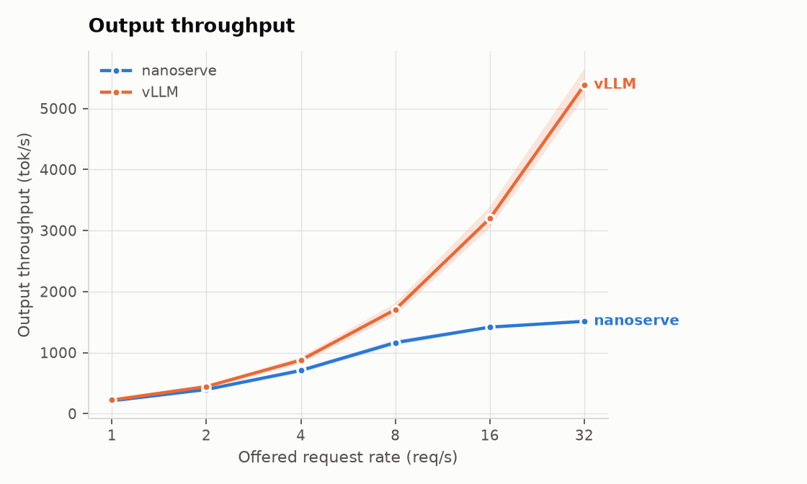

# nanoserve

**An LLM inference engine you can actually read.**

Continuous batching, paged KV cache, and an OpenAI-compatible streaming
server in ~1.3k lines of single-GPU Python, built to understand how
vLLM-class systems work, and benchmarked honestly against the real thing.


## Why this exists

Production inference engines are 100k+ line codebases. nanoserve implements
the same core ideas at a scale one person can hold in their head:

| Idea | Where it lives |
| --- | --- |
| PagedAttention-style KV management | `nanoserve/block_manager.py`, `nanoserve/kv_cache.py` |
| Iteration-level scheduling (continuous batching) | `nanoserve/scheduler.py` |
| flash-attn varlen prefill + paged decode | `nanoserve/model/attention.py`, `nanoserve/model_runner.py` |
| Step loop and OpenAI-compatible streaming | `nanoserve/engine.py`, `nanoserve/server.py` |
| HF-exact model forward pass | `nanoserve/model/` |

Scope is deliberately single-GPU. Everything here is a technique that a
production engine also has, at a size one person can read in an afternoon.

## Quickstart

Uses [uv](https://docs.astral.sh/uv/) for package management.

```bash
git clone https://github.com/LarryWg/nanoserve.git
cd nanoserve
uv sync
uv run pytest            # fast tests, no downloads
uv run pytest -m slow    # adds the HF equivalence suite (downloads ~2.5 GB)
```

The slow suite is the heart of the project: it loads real Qwen checkpoints
and proves nanoserve matches HuggingFace **token-for-token** in a 50-step
greedy decode -- first for the plain forward pass, then again with every
token after the first served out of the paged KV cache.

To serve a model (needs a GPU, since decode runs on the paged path):

```bash
uv run python -m nanoserve.server Qwen/Qwen3-0.6B
curl localhost:8000/v1/completions \
  -d '{"prompt": "The capital of France is", "max_tokens": 16, "stream": true}'
```

The attention kernels are CUDA only. On a linux GPU box `uv sync` installs
them along with everything else; without a GPU the tests that need them skip
themselves. `docs/gpu-setup.md` explains why torch and the kernel wheel are
pinned to each other.

## How a request flows

```
prompt -> FastAPI -> Scheduler (continuous batching, preemption)
                  -> BlockManager (paged KV cache)
                  -> ModelRunner (prefill + decode)
                  -> streamed tokens
```

## Current state

- [x] Model forward pass verified token-for-token against HuggingFace
      (Qwen3-0.6B, Qwen2.5-0.5B-Instruct, every architectural branch covered)
- [x] Paged KV block manager with allocation invariants under test
- [x] Continuous batching scheduler: FCFS admission, token budget,
      recompute preemption
- [x] Paged KV cache decode: flash-attn varlen prefill, `flash_attn_with_kvcache`
      decode, KV cache sized from measured free VRAM. Verified token-for-token
      against HF through the cache, and per step against the no-cache path
      across block boundaries, batching, and preemption
- [x] Engine step loop: submit, abort, and per-request token streams, with
      the scheduler under a lock and the forward pass outside it
- [x] OpenAI-compatible streaming server: `/v1/completions` over SSE,
      incremental detokenization, client disconnect frees the KV blocks.
      `/health` reports the measured cache size and `/metrics` the
      server's own TTFT, to check a load generator against
- [x] Benchmarks vs HF generate and vLLM: ShareGPT under Poisson arrivals,
      3 runs per point, with the gap to vLLM measured and attributed
- [ ] The per-step overhead above: CUDA graphs, or at least a decode step
      that does not rebuild its metadata in python every time
- [ ] Chunked prefill and prefix caching, the two remaining single-GPU
      techniques vLLM has on by default and nanoserve does not have at all

Multi-GPU serving (tensor/pipeline parallelism) is out of scope on purpose.

## Benchmarks

RTX 4090 24GB, Qwen3-0.6B, bf16, 200 ShareGPT prompts, Poisson arrivals,
mean of 3 runs. vLLM 0.27.1 at its defaults, HF static batching with the
batch size swept and the best taken. Method in `benchmarks/README.md`.



| offered rate | nanoserve | | | vLLM | | |
| --- | --- | --- | --- | --- | --- | --- |
| req/s | tok/s | attained | TTFT p99 | tok/s | attained | TTFT p99 |
| 1 | 182 | 0.95 | 74 ms | 193 | 1.01 | 42 ms |
| 2 | 332 | 1.73 | 79 ms | 385 | 2.01 | 43 ms |
| 4 | 548 | 2.86 | 83 ms | 765 | 3.99 | 42 ms |
| 8 | 682 | 3.57 | 2194 ms | 1483 | 7.73 | 50 ms |
| 16 | 720 | 3.78 | 9640 ms | 2754 | 14.37 | 63 ms |
| 32 | 736 | 3.86 | 14317 ms | 4533 | 23.69 | 72 ms |

Offline, every prompt available at t=0: nanoserve **1068** tok/s, vLLM
**5837**, HF static batching **378**. Continuous batching is worth 2.8x
over static batching; the rest of this section is the 5.5x we give back.

**Read the attained column first.** nanoserve saturates at 3.9 req/s.
Past that the queue grows without bound, so the rows below it describe a
queue rather than an engine -- that is what a 14 second p99 is. vLLM was
still keeping up at 23.7 req/s and had not clearly saturated at the top of
the sweep.

### Where it goes

One number explains most of it. A decode step costs the same 24 ms whether
it is serving 1 sequence or 64:

| batch | 1 | 4 | 16 | 64 |
| --- | --- | --- | --- | --- |
| ms/step | 23.5 | 23.4 | 24.7 | 25.3 |
| tok/s | 42 | 171 | 648 | 2529 |

At 0.6B the actual GPU work at batch 64 is a couple of milliseconds, so
about 20 ms of every step is fixed cost that has nothing to do with the
model: python building the step's metadata, several small host to device
copies, and the syncs sampling forces. vLLM erases nearly all of it with
CUDA graphs.

That is the whole saturation gap. At its ceiling nanoserve moves 736 tok/s,
which at 24 ms per step is about 18 tokens per step. vLLM is not running a
bigger batch -- it is running a similar one roughly six times more often.

Two more, measured rather than asserted:

- **Inter-token latency follows directly.** nanoserve's ITL p99 is 57-99 ms
  against vLLM's 5-15 ms, which is the same 24 ms step seen from the other
  end.
- **Pages are 16x too big.** flash-attn will not take a KV page smaller than
  256 tokens; vLLM's default is 16. Over these prompt lengths that wastes
  28% of the cache against 1.5%, so the same VRAM holds far fewer sequences.

And one the benchmark turned up that was not on the list. nanoserve's ITL
stays flat while its queue explodes, which is not how an overloaded decode
loop should look. 99 ms of ITL is about four steps between a sequence's
tokens, so roughly three steps in four at saturation are prefills, not
decodes. That is `prefill_first=True` under sustained overload: the waiting
queue is never empty, so new arrivals keep winning the step. `scheduler.py`
called this out as the thing to benchmark once a server existed, and it is
a one line change to test.

Not yet measured: how much of the rest is chunked prefill and prefix
caching, both of which vLLM has on by default and nanoserve does not have
at all.
